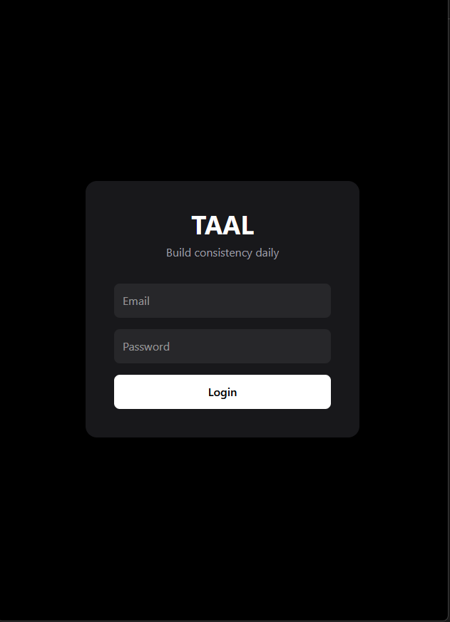
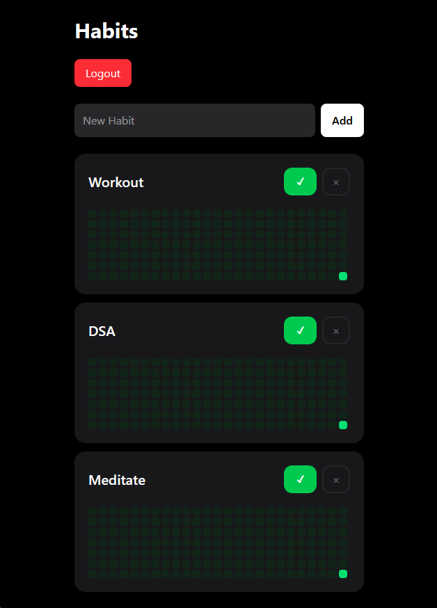
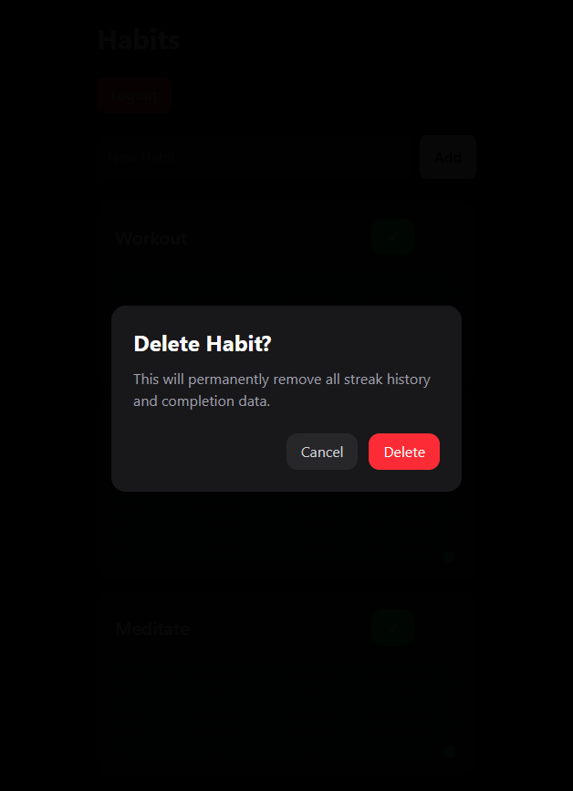

# TAAL — Habit Tracking App

TAAL is a modern full-stack habit tracking application built with:

* Spring Boot
* PostgreSQL
* React
* Tailwind CSS
* JWT Authentication

The app helps users build consistency through visual streak tracking and GitHub-style contribution heatmaps.

---

# Features

## Authentication & Security

* JWT-based authentication
* Secure login system
* Protected backend routes
* Multi-user habit isolation
* Authorization checks for habit ownership

---

## Habit Management

* Create habits
* View habits
* Delete habits
* Toggle habit completion
* Undo accidental completions
* Confirmation modal before destructive actions

---

## Habit Analytics

* Dynamic streak calculation
* GitHub-style contribution heatmap
* Historical completion visualization
* Daily completion tracking

---

# Tech Stack

## Backend

* Java
* Spring Boot
* Spring Security
* JWT
* PostgreSQL
* Hibernate / JPA
* Maven

## Frontend

* React
* Vite
* Tailwind CSS
* JavaScript

---

# Project Structure

```bash
TAAL/
│
├── backend/
│   ├── src/
│   ├── pom.xml
│   └── mvnw
│
├── frontend/
│   ├── src/
│   ├── package.json
│   └── vite.config.js
│
└── .gitignore
```

---

# Screenshots

## Login Screen



## Habit Dashboard



## Contribution Heatmap



---

# Backend Setup

## 1. Clone Repository

```bash
git clone <your-repo-link>
cd taal
```

---

## 2. Configure PostgreSQL

Create a PostgreSQL database.

Update:

```properties
backend/src/main/resources/application.properties
```

with your credentials.

Example:

```properties
spring.datasource.url=jdbc:postgresql://localhost:5432/taal
spring.datasource.username=postgres
spring.datasource.password=yourpassword
```

---

## 3. Run Backend

```bash
cd backend
./mvnw spring-boot:run
```

Backend runs on:

```bash
http://localhost:8080
```

---

# Frontend Setup

## 1. Install Dependencies

```bash
cd frontend
npm install
```

---

## 2. Start Frontend

```bash
npm run dev
```

Frontend runs on:

```bash
http://localhost:5173
```

---

# API Endpoints

## Authentication

| Method | Endpoint           |
| ------ | ------------------ |
| POST   | /api/auth/register |
| POST   | /api/auth/login    |

---

## Habits

| Method | Endpoint                  |
| ------ | ------------------------- |
| GET    | /api/habits               |
| POST   | /api/habits               |
| POST   | /api/habits/{id}/complete |
| DELETE | /api/habits/{id}          |

---

# Key Engineering Concepts Implemented

* JWT authentication flow
* REST API design
* Protected routes
* Service-layer authorization
* Cascade deletion
* Multi-user data isolation
* Dynamic streak computation
* React state management
* Conditional rendering
* Responsive UI design
* Contribution heatmap rendering

---

# Future Improvements

* Edit habit names
* Habit categories
* Weekly/monthly analytics
* Mobile PWA support
* Dark/light themes
* Habit reminders
* User profile pages
* Deployment

---

# Author

Vedansh Vaidya

Built as a full-stack portfolio project focused on backend architecture, modern frontend UX, and product-oriented design.
